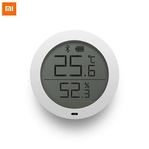

# mijia-sensor-domoticz

Adapted version of mijia-sensor-domoticz (https://github.com/pFenners/mijia-sensor-domoticz) for supporting the V2 version of the Xiaomi Mijia Bluetooth Temperature Humidity Sensor.

 

Adapted version of miflora (https://github.com/Tristan79/miflora) for the Xiaomi Mijia Bluetooth Temperature Humidity Sensor (MJ_HT_V1).

The Xiaomi Mijia sensor provides temperature and humidity over BLE.

## Preparing Domoticz
Create a virtual sensor (Temperature & Humidity) in Domoticz for each of your Xiaomi Mijia sensors.

Note down the IDX value for the virtual sensor.

## Finding the Bluetooth MAC Address for the sensor 
Turn on the sensor (insert battery).

Run the following command to find the MAC address:

`sudo hcitool lescan`

The address will be listed with the name 'MJ_HT_V1'

Note down the MAC Address for the sensor.

## Edit the domoticz_mijia.py script
Enter your domoticz connection details in the varibles at the top of the script.

Edit the 'update' lines at the end of your script, enter the IDX and MAC address for each sensor.

e.g.
`update("4C:65:A8:D0:4C:98","752")`

## Schedule the polling
Enable this script to run at a regular interval (30 mins):

`sudo crontab -e`

And then add this line:

`*/30 * * * * /usr/bin/python3 /home/pi/mijia-sensor-domoticz/domoticz_mijia.py >/dev/null 2>&1`
